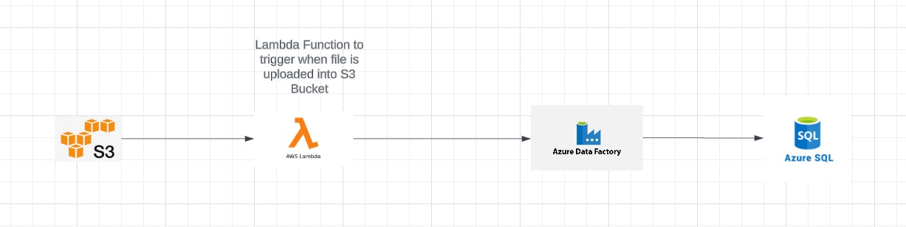

# S3 to SQL with ADF and Lambda Triggers

## Overview

 

This project demonstrates how to automate the process of loading data from an Amazon S3 bucket into an Azure SQL database using Azure Data Factory (ADF) triggered by an AWS Lambda function. The pipeline is initiated whenever a new CSV file is uploaded to the S3 bucket, and the file is dynamically processed and stored in the SQL database.

## Key Components

- **AWS S3**: Used for storing CSV files that trigger the data pipeline.
- **AWS Lambda**: Automatically triggers the ADF pipeline upon file upload to S3.
- **Azure Data Factory (ADF)**: Handles the ETL process, moving data from S3 to SQL.
- **Azure SQL Database**: The final destination for the processed data.

## Prerequisites

- **AWS Account**: 
  - S3 bucket
  - IAM user with appropriate permissions
  - Lambda function
- **Azure Account**:
  - Azure SQL Database
  - Azure Data Factory
  - Service Principal with necessary permissions
- **Python 3.8+**: Installed locally for running and testing the Lambda function.

## Setup Instructions

### AWS Setup

1. **IAM Setup**:
   - Create an IAM user with S3 read-only access.
   - Generate an access key for this user.

2. **S3 Bucket Setup**:
   - Create an S3 bucket to store the CSV files.
   - Ensure the bucket's path is correctly configured in the Lambda function.

3. **Lambda Function Setup**:
   - Create a Lambda function in AWS.
   - Use the provided Python code to handle file uploads and trigger the ADF pipeline.
   - Add necessary environment variables, including ADF access tokens.

4. **Lambda Layers**:
   - Create a layer for the `requests` library to allow the Lambda function to make API calls.
   - Upload the zipped layer to the Lambda function.

### Azure Setup

1. **Azure Data Factory (ADF)**:
   - Create a new ADF instance.
   - Design a pipeline that ingests data from S3 and loads it into the SQL database.
   - Set up the pipeline to accept dynamic file names from Lambda.

2. **Azure SQL Database**:
   - Create a SQL Database.
   - Design the schema to match the CSV data structure.

3. **Service Principal and Permissions**:
   - Register a new app in Azure Active Directory (AAD) for ADF access.
   - Assign appropriate roles to the app, enabling it to trigger the ADF pipeline.

### Running the Pipeline

1. **Upload CSV to S3**:
   - Upload a CSV file with the correct schema to the S3 bucket.

2. **Monitor Lambda and ADF**:
   - Use AWS CloudWatch to monitor the Lambda function's execution.
   - Check ADF pipeline runs to ensure successful data loading into the SQL database.

3. **Verify Data**:
   - Query the Azure SQL Database to confirm the data has been correctly ingested.

## Troubleshooting

- Ensure that all environment variables and IAM roles are correctly configured.
- Verify that the S3 bucket and Azure SQL schema are compatible.
- Use Jupyter Notebook for local testing of the Lambda function before deployment.

## License

This project is licensed under the MIT License. See the [LICENSE](LICENSE) file for details.

## Contact

For any questions or feedback, please contact [your-email@example.com](mailto:your-email@example.com).
